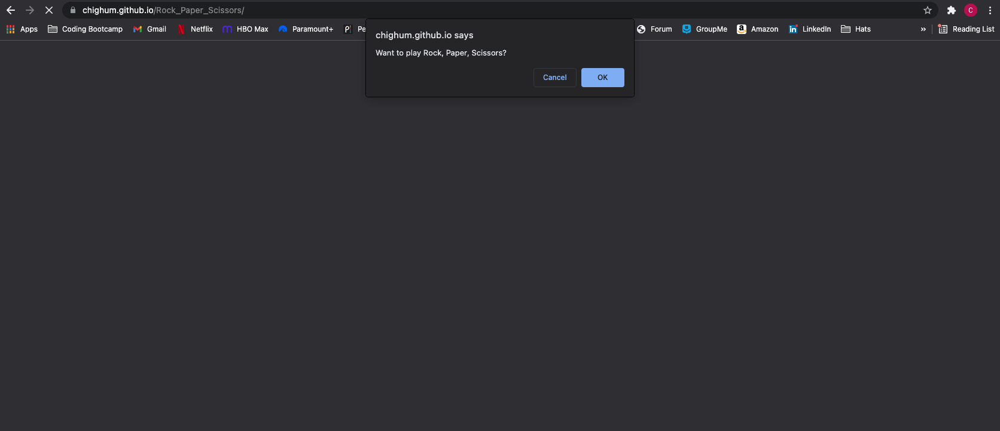
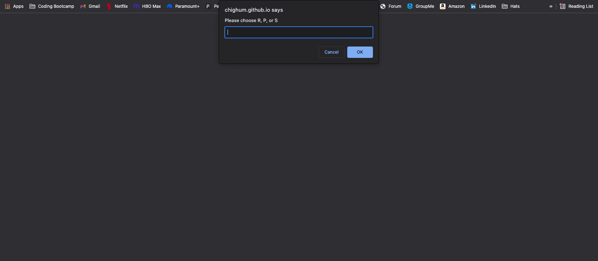
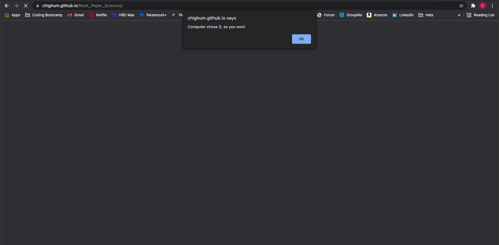
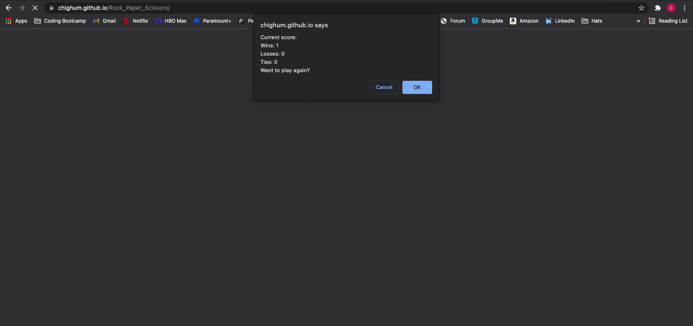

# Rock_Paper_Scissors

## Description

This is a very simple rock, paper, scissors game where the user plays against the computer written using JavaScript alerts, confirms, and prompts.
The user is first given a window confirm asking if they would like to play rock, paper, scissors, and if they select then they are shown a prompt to select R, P,
or S to keep things easy on the user and not make them type out the full word. Next, the computer picks randomly between R, P, and S and compares its choice to
the user's choice and determines a winner. In the end, the computer keeps tracks of how many times the user wins and loses. Lastly, the user has the option to
play again or exit.

## Usage

If you would like to give my computer generated rock, paper, scissors game a try you can access it with this link:

You can also see a few screenshots of the deployed website in action below:

